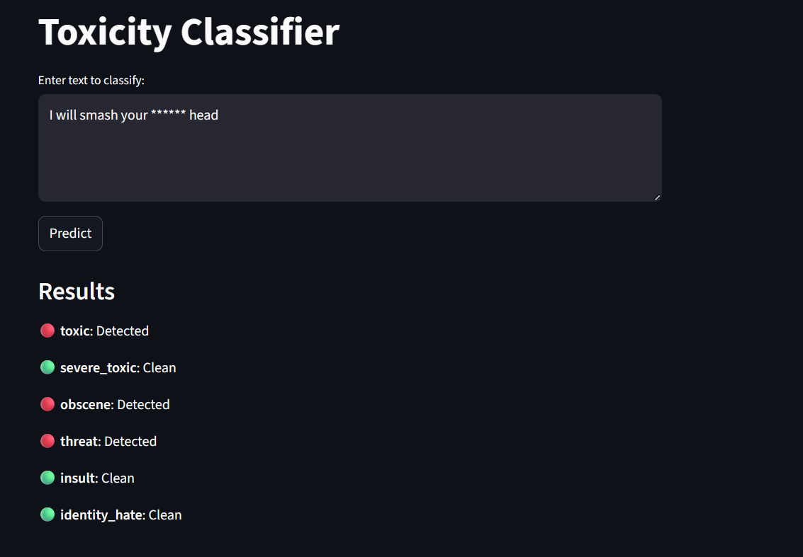

# Jigsaw Toxicity Prediction

End-to-end NLP system for detecting toxic content across 6 categories. Fine-tuned DistilBERT on 160k samples, served via FastAPI, and visualized through a Streamlit interface.

---

## Demo

> Enter any text → get per-label toxicity predictions instantly.



---

## Labels

| Label | Description |
|---|---|
| `toxic` | General toxicity |
| `severe_toxic` | Highly aggressive language |
| `obscene` | Profane or vulgar content |
| `threat` | Direct threats of harm |
| `insult` | Personal attacks |
| `identity_hate` | Hate based on identity |

---

## Architecture

```
User Input (Streamlit UI)
        │
        ▼
POST /api/v1/predict  (FastAPI)
        │
        ▼
PredictService
  ├── clean_text()          ← preprocessor
  ├── DistilBertTokenizer   ← HuggingFace
  ├── DistilBERTClassifier  ← fine-tuned model
  └── per-label thresholds  ← tuned on val set
        │
        ▼
{"toxic": 1, "obscene": 0, ...}
```

---

## Model

- **Base:** `distilbert-base-uncased`
- **Dataset:** [Jigsaw Toxic Comment Classification](https://huggingface.co/datasets/anitamaxvim/jigsaw-toxic-comments) (~160k samples)
- **Training:** Last 2 transformer layers fine-tuned, BCEWithLogitsLoss with `pos_weight` for label imbalance
- **Thresholds:** Per-label threshold tuning to maximize F1 per class

---

## Project Structure

```
├── api/
│   ├── main.py        # FastAPI app + lifespan
│   ├── router.py      # prediction endpoint
│   └── schemas.py     # Pydantic request/response models
├── app/
│   └── app.py         # Streamlit UI
├── src/
│   ├── model.py       # DistilBERTClassifier
│   ├── predict.py     # PredictService (inference)
│   ├── train.py       # training script
│   ├── trainer.py     # Trainer class
│   ├── dataset.py     # dataset loading
│   ├── preprocessor.py
│   └── utils/
│       ├── constants.py
│       └── logger.py
├── models/            # saved model weights + thresholds
├── config.yaml        # all paths and hyperparameters
├── Dockerfile.api
├── Dockerfile.ui
└── docker-compose.yml
```

---

## Quickstart

**1. Clone the repo**
```bash
git clone https://github.com/youssefhessain1102/Jigsaw-Toxicity-Prediction.git
cd Jigsaw-Toxicity-Prediction
```

**2. Install dependencies**
```bash
pip install -r requirements.txt
```

**3. Start the API** (terminal 1)
```bash
uvicorn api.main:app --reload
```

**4. Start the UI** (terminal 2)
```bash
streamlit run app/app.py
```

**5. Open** `http://localhost:8501`

---

## API

**Endpoint:** `POST /api/v1/predict`

**Request:**
```json
{
  "text": "I hate you so much"
}
```

**Response:**
```json
{
  "predictions": {
    "toxic": 1,
    "severe_toxic": 0,
    "obscene": 0,
    "threat": 0,
    "insult": 0,
    "identity_hate": 0
  },
  "text_received": "I hate you so much"
}
```

Interactive docs available at `http://localhost:8000/docs`

---

## Docker

Dockerfiles and `docker-compose.yml` are included for containerized deployment:

```bash
docker compose up --build
```

---

## Tech Stack

- [HuggingFace Transformers](https://huggingface.co/docs/transformers) — DistilBERT
- [PyTorch](https://pytorch.org/) — model training & inference
- [FastAPI](https://fastapi.tiangolo.com/) — REST API
- [Streamlit](https://streamlit.io/) — UI
- [Pydantic](https://docs.pydantic.dev/) — request validation
- [Docker](https://www.docker.com/) — containerization
